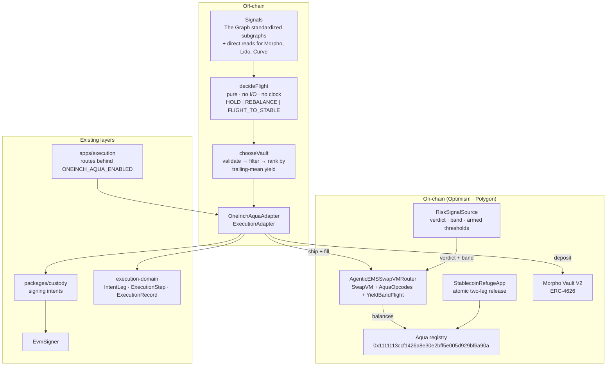

# Architecture

## The one-sentence version

A fixed-income strategy flees to a stablecoin when its yield falls under a floor or its volatility
breaches a cap; the flee is a **SwapVM program containing an instruction we wrote**, and the
proceeds are deployed into a **Morpho vault**.

## Why it is shaped this way

Three constraints decided almost everything, and each was discovered rather than assumed.

**1. The domain decides the chain set.** `@ethonline2026/execution-domain` defines
`CHAIN_KEYS = ["base", "polygon", "optimism"]`, and its `IntentLeg`, `ExecutionStep`,
`ExecutionPlan` and `ExecutionRecord` all carry a `ChainKey`. A leg on Ethereum has no way to be
described. So the package covers **Optimism and Polygon** — the intersection — and
`ChainKey` here is a *subset* of the domain's, which makes the mapping an identity rather than a
translation table. That is worth more than it sounds: there is no place where a chain can be
mistranslated, because there is nowhere to translate.

**2. The decision is cheap off-chain and must be enforced on-chain.** Trailing-mean yields, realised
volatility and vault liquidity all need history a contract cannot hold. The verdict therefore lives
off-chain, but it is *stored on-chain* in `RiskSignalSource` so the instruction can refuse a take
that ignores it. A policy that lives only in a process is a policy a taker can skip.

**3. A vault is a position, not an order book.** Morpho Vaults are ERC-4626 — `asset()`,
`deposit()`, `redeem()` — so the destination leg reuses the existing `deposit`/`withdraw` hop kinds
and the existing `insufficient_liquidity` failure. **A whole new protocol, with zero new
vocabulary.** That was the design bet, and it held.

## Components



## The two Aqua apps, and why they are separate

This is the distinction most easily got wrong, so it is worth stating plainly.

| | `AgenticEMSSwapVMRouter` | `StablecoinRefugeApp` |
|---|---|---|
| What you ship to it | `aqua.ship(router, order.encode(), tokens, amounts)` | `aqua.ship(app, abi.encode(strategy), tokens, amounts)` |
| What it is | a **SwapVM position** — the order's program prices its own fills | a **position that can exit atomically** |
| Its logic | the full Aqua instruction set plus our opcode | none: one call moves both legs to the maker |
| Who acts | a taker, calling `swap()` | the maker, or a maker-named relayer |

In SwapVM's Aqua mode the *app* argument to `Aqua.ship` **is the router** — that is what makes an
order a position rather than a signed message. `StablecoinRefugeApp` is a second, independent app
whose only job is that the flight's two steps (swap, then deposit) can be entered and exited
without a window of half-executed risk.

### A constraint that shaped `StablecoinRefugeApp`

`Aqua.ship` and `Aqua.dock` credit **`msg.sender`** as the maker:

```solidity
// Aqua.sol
function ship(address app, bytes calldata strategy, ...) external returns (bytes32) {
    Balance storage balance = _balances[msg.sender][app][strategyHash][tokens[i]];
```

So an app that *proxied* `ship` on the maker's behalf would record the app as the maker, and every
later `pull` — which looks up `_balances[maker][msg.sender]` — would silently find a zero balance.
This is why `StablecoinRefugeApp` deliberately exposes **no** `ship` or `dock`: the maker calls Aqua
directly, passing `address(this)` as the app, and the contract exposes only `refuge`, where `pull`'s
`msg.sender` genuinely must be the app. It is pinned as
`test_aquaCreditsTheCallerAsMaker_notTheApp`.

## The instruction

```
[balances] → [swap curve: XYCSwap] → [YieldBandFlight] → [invalidator]
```

`YieldBandFlight` reads amounts the curve produced and writes them back, so **it must come last**.
Placed before the curve it would be overwritten — a guard that appears in the program, appears in
the logs, and does nothing. `test_largerTradesGetEqualOrWorsePricesWithTheBandActive` and the
rounding tests both run with the guard active, which is the only way to notice a broken clamp.

| Direction | Operation | Rounding |
|---|---|---|
| `exactIn` | `amountOut = min(amountOut, amountIn × band / 1e18)` | floor — the taker gets marginally less |
| `exactOut` | `amountIn = max(amountIn, ceil(amountOut × 1e18 / band))` | ceil — the taker pays marginally more |

Both round toward the maker, matching SwapVM's own fifth invariant. A ceiling in the first case
would be extractable one wei at a time.

### Precedence

The source's band wins; the compiled band applies when the source has no opinion; nothing is
enforced when neither has one. `maxRateOut == 0` is the "no opinion" sentinel, which is why
`RiskSignalSource.setSignal` refuses to store a band behind a cancelled flight.

## Boundary of trust

| Actor | Can | Cannot |
|---|---|---|
| Agent (policy process) | arm / cancel a flight, set the band, set the armed thresholds | move funds, change the router, rotate itself |
| Taker | fill an armed order at or better than the band | fill below the band; fill a strategy with no liquidity behind it |
| Relayer (named per strategy) | trigger a release from `StablecoinRefugeApp` | redirect a single token — the destination is the maker and is not a parameter |
| Router owner | rescue tokens sent to the router by mistake | touch a position's balances |

The agent's address is `immutable`. Rotating it means deploying a new signal source and shipping a
new program — the honest cost of not having a privileged upgrade path, since whoever sets the
verdict controls whether a strategy can be taken and at what price.

## Where the money actually is

Nowhere in a contract. Aqua tracks **virtual balances**: the maker's tokens stay in the maker's
wallet under an approval, and the registry records what an app may pull. So `StablecoinRefugeApp`
releasing a position is the maker's tokens moving from the maker to the maker, and the vault
deposit is a standard ERC-4626 call from whoever holds the proceeds.

That is also why the flight's two legs are separate `ExecutionStep`s: a failed deposit must not read
as a failed swap, and the stablecoin must never be stranded between them.
